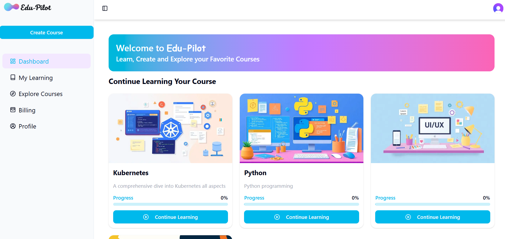
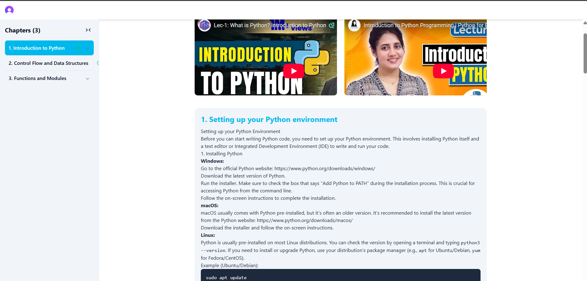
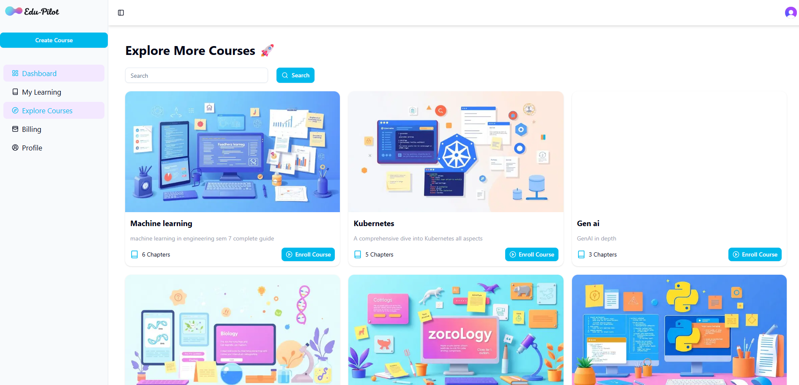

# **EduPilot** 🚀  

> An AI-powered modern learning platform with authentication, billing, and seamless AI integration.  

---

## 🔰 Badges  

  
  
  
  
  
  

---

## 🌐 Live Demo  
🔗 [edu-pilot.mohitcodes.xyz](https://edu-pilot.mohitcodes.xyz)  

---

## 📖 About  
**Edu-Pilot** is a revolutionary web application designed to democratize education. In a world where knowledge is key, creating comprehensive course material can be a significant hurdle. Edu-Pilot tackles this challenge head-on by leveraging cutting-edge AI to generate entire courses from a simple prompt.

Users can specify a topic, the number of chapters, and other parameters, and Edu-Pilot will instantly generate a structured course complete with detailed text and relevant, curated videos for an enhanced learning experience. Whether you're an educator looking to create content quickly or a student eager to learn a new skill, Edu-Pilot is your intelligent co-pilot on the journey of learning. 

---

## ✨ Features  
- 🔐 **Authentication & Billing** powered by [Clerk](https://clerk.com)  
- 🤖 **AI Integration** using [OpenAI](https://platform.openai.com) & [Gemini](https://ai.google.dev/) APIs  
- 📚 **Course Management**: Create, manage, and explore courses easily  
- 🎓 **Student & Instructor Dashboards** with personalized content  
- 💳 **Secure Payments** for course subscriptions  
- 📱 **Responsive UI** for desktop and mobile  
- ⚡ **Modern Tech Stack** optimized for scalability and performance  

---

## 🛠️ Tech Stack  
- **Frontend**: React + Tailwind CSS  
- **Backend**: Node.js + Express  
- **Database**: MongoDB  
- **Authentication & Billing**: Clerk  
- **AI APIs**: OpenAI, Gemini  
- **Deployment**: AWS + Custom Domain  

---

## 📸 Screenshots  

### 🔹 Dashboard & Course Creation  

   

### 🔹 My Learnings

  

### 🔹 Subscription Plans  

  

### 🔹 Explore Courses  

  

---

## 🚀 Getting Started  

Follow these steps to run the project locally:  

```bash
# 1. Clone the repository
git clone https://github.com/mohitjeswani01/edu-pilot.git

# 2. Navigate into the project
cd edu-pilot

# 3. Install dependencies
npm install
